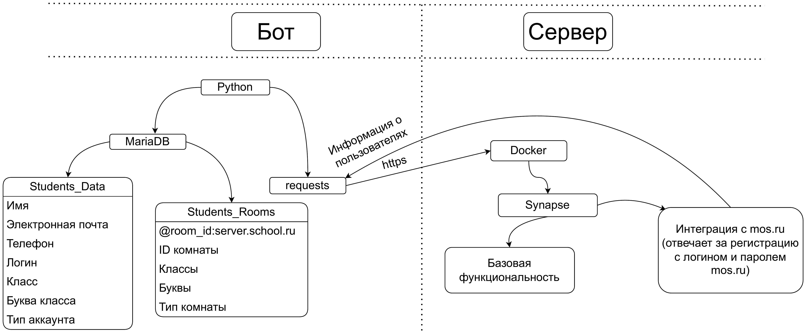

# Matrix mos integration

This is a school project that aims to automate chat management with [Matrix](https://matrix.org)

## Usage

```
usage: main.py [-h] [-v | -q] [-c FILE] [-C {always,auto,never}] [-l] [-L]
               [-g] [-k] [-p ROOM_ID] [-P USER_ID ROOM_ID POWER_LEVEL]
               [-D ROOM_ID DESCRIPTION]
               [-r NAME SURNAME PATRONIC GRADE LETTER PHONE LOGIN STATUS PASSWORD]
               [-t] [-m ROOM_ID] [-M] [-i ROOM_ALIAS] [-a ROOM_ID] [-U]
               [--drop-all-databases] [-n]

options:
  -h, --help            show this help message and exit
  -v, --verbose         Print more output
  -q, --quiet           Don't print anything
  -c, --config FILE     Config file (json)
  -C, --color {always,auto,never}
                        Colorize the output
  -l, --list-users      Get a list of all users from the database (json)
  -L, --list-rooms      Show information about all rooms from the database
                        (json)
  -g, --generate        Create all necessary rooms and invite students there
  -k, --generate-key    Generate a fernet key for encryption. Overwrites
                        previous keyfile.txt. The previous file is backed up
                        to keyfile.txt.bak just in case
  -p, --permissions ROOM_ID
                        Get current permissions in a room
  -P, --set-permission USER_ID ROOM_ID POWER_LEVEL
                        Set a power level for a user in a room
  -D, --set-description ROOM_ID DESCRIPTION
                        Set a new description for a room
  -r, --register NAME SURNAME PATRONIC GRADE LETTER PHONE LOGIN STATUS PASSWORD
                        Register user manually. STATUS is one of the following
                        strings: student, teacher
  -t, --testing         Run in a testing mode (create some students and rooms
                        for testing purposes). Useful with --generate
  -m, --members ROOM_ID
                        Get a list of room members
  -M, --get-all-members
                        Get a list of all rooms in the system with all of
                        their members
  -i, --get-id ROOM_ALIAS
                        Get room id from ROOM_ALIAS
  -a, --get-aliases ROOM_ID
                        Get room aliases from ROOM_ID
  -U, --gui             Launch PyQt-based GUI
  --drop-all-databases  Drop ALL databases with students data. Use CAREFULLY
  -n, --no-autofetch    Don't fetch new students from the server. Fetching is
                        enabled by default
```

## User guide

### Как войти на сервер?

1. Узнайте свой логин пользователя: https://school.mos.ru/passport/data#address
2. Скачайте клиент matrix, например [Element](https://element.io/) ([iOS](https://apps.apple.com/us/app/element-messenger/id1083446067), [Android](https://play.google.com/store/apps/details?id=im.vector.app), [Windows](https://packages.riot.im/desktop/install/win32/x64/Element%20Setup.exe), [Web](https://app.element.io/), [etc.](https://element.io/download))
3. Введите адрес сервера вместо matrix.org
4. В поле логина введите логин пользователя из шага 1.
5. В поле пароля введите пароль от учётной записи school.mos.ru
6. Нажмите кнопку <kbd>Войти</kbd> или <kbd>Sign in</kbd>
7. Вам придёт код в SMS и будет сказано, что неправильный пароль. Если код пришёл, значит пароль правильный
8. Сотрите пароль из ввода пароля и введите туда код из SMS. Это нужно для получения Вашего ФИО и класса обучения
9. Нажмите кнопку <kbd>Войти</kbd> или <kbd>Sign in</kbd>

Если всё сделано правильно, то вы войдёте в систему!

Если Вам нужно будет снова войти в систему, то введите логин и пароль от МЭШ и вводить код из SMS не потребуется.

Если Вы измените пароль в клиенте Matrix (например в Element), то вводите этот пароль.

Логин для человека с ФИО "Пушкин Александр Сергеевич" будет выглядеть так: `pushkinas`. Также в конце могут быть цифры, если человек с логином `pushkinas` уже существует, например `pushkinas4`

Если SMS код не приходит, значит, что вы ввели неправильный логин/пароль или пытались войти слишком много раз. Во втором случае стоит подождать.

Если забыли свой пароль от системы (не от mos.ru), то вы можете ввести логин и пароль от mos.ru, Вам придёт sms, введите его как пароль и Вы войдёте в систему

## Как работает эта система?



## Requirements
 - Matrix server (can be installed automatically)
 - MariaDB
 - Nginx
 - Python

## Setup

```shell
git clone https://github.com/astlecat/matrix_mos_integration
```

### Server

First, make sure that you've set all passwords in [`config.sh`](config.sh)

Then run the setup script:

```shell
bash setup.sh
```

### Bot

#### Dependencies

First install `rust` (needed for building a dependency for [`octodiary`](https://pypi.org/project/octodiary/)):

Termux
```shell
pkg install rust
```

Debian / Ubuntu
```shell
sudo apt update && sudo apt install rustc
```

Arch
```shell
sudo pacman -Sy rust
```

#### Installation

```shell
# Create and activate python virtual environment
python3 -m venv venv
source venv/bin/activate

export CC=clang
# Install the dependencies
pip install -r requirements.txt

# Run with a configuration file "config.json"
python main.py --config config.json
```

> [!NOTE]
> `CC=clang` is needed to install `mariadb` with pip on Arch Linux because gcc complains about types

#### GUI

If you want to use a GUI, then you should install `PyQt6`

```shell
# Install PyQt6 after activating python virtual enviromnent
pip install PyQt6
```

Then, you can run the bot with a gui

```shell
python main.py -vc config.json --gui
```

### MariaDB

#### Termux

```
./termux-mariadb.sh
```

#### Termux Troubleshooting

If you get an error similar to this

```
ImportError: dlopen failed: library "libmariadb.so" not found: needed by /data/data/com.termux/files/usr/lib/python3.12/site-packages/mariadb/_mariadb.cpython-312.so in namespace (default)
```

Try running with a proper `LD_LIBRARY_PATH`
```shell
# set this variable so that the linker knows where is libmariadb.so
export LD_LIBRARY_PATH=/data/data/com.termux/files/usr/lib/aarch64-linux-android
# then run the program
python main.py -c config.json -g
```

#### Arch linux

Run as root:

```shell
# Set the password
PASSWORD='secret'

# Install the package
pacman -Sy mariadb

# Install the database itself
mariadb-install-db --user=mysql --basedir=/usr --datadir=/var/lib/mysql

# Start the daemon
systemctl start mariadb

printf '%s\n' "use mysql;
set password for 'root'@'localhost' = password('$PASSWORD');
flush privileges;" | mariadb
```

Then, after creating python virtual environment, install `mariadb` python package:

```shell
CC=clang pip install mariadb
```
